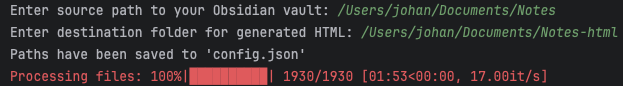
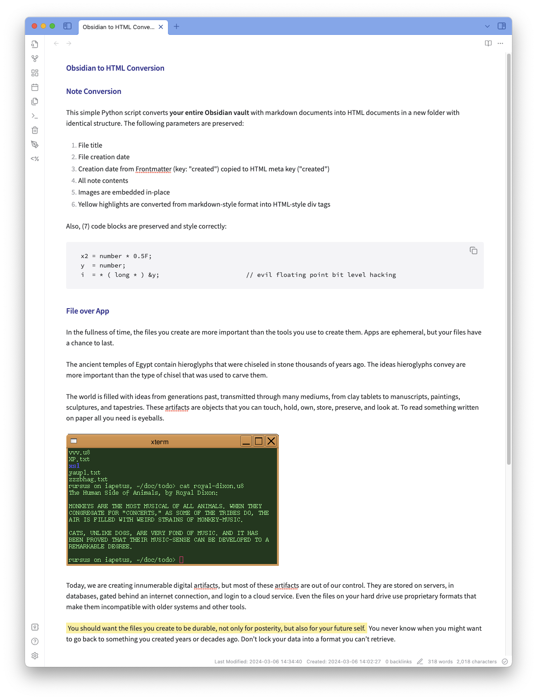
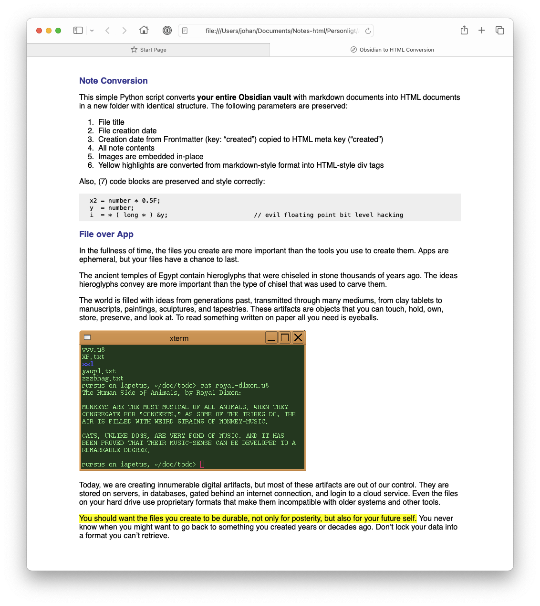

# ObsidianToHtml
This Python script **for Windows and MacOS** converts your entire Obsidian vault with markdown documents into HTML documents in a new folder with identical structure. The script uses Pandoc and will convert the following parameters:

1. File name
2. File creation date
3. Meta data "Creation date" from Frontmatter (key: "created") copied to HTML meta key ("created")
4. All note contents
5. Images are embedded in-place
6. Yellow highlights are converted from markdown-style format into HTML-style div tags
7. Code comments are colored correctly
8. Document links are fully supported

## IMPORTANT

1. You can exclude folders you do not want to process using the variable "excluded_dirs". This is already set to {'_excalidraw', '_resources', '_templates', '.obsidian', '.trash'}.
2. You can modify the HTML template according to your likings, the file is called "template.html".

To run the script you need Python and Pandoc installed. For Python environment [I recommend PyCharm CE](https://www.jetbrains.com/pycharm/download/other.html), [Pandoc can be downloaded here](https://pandoc.org/installing.html).

## EXAMPLES

Here is a simple example showing how elements are converted from Markdown to HTML:

