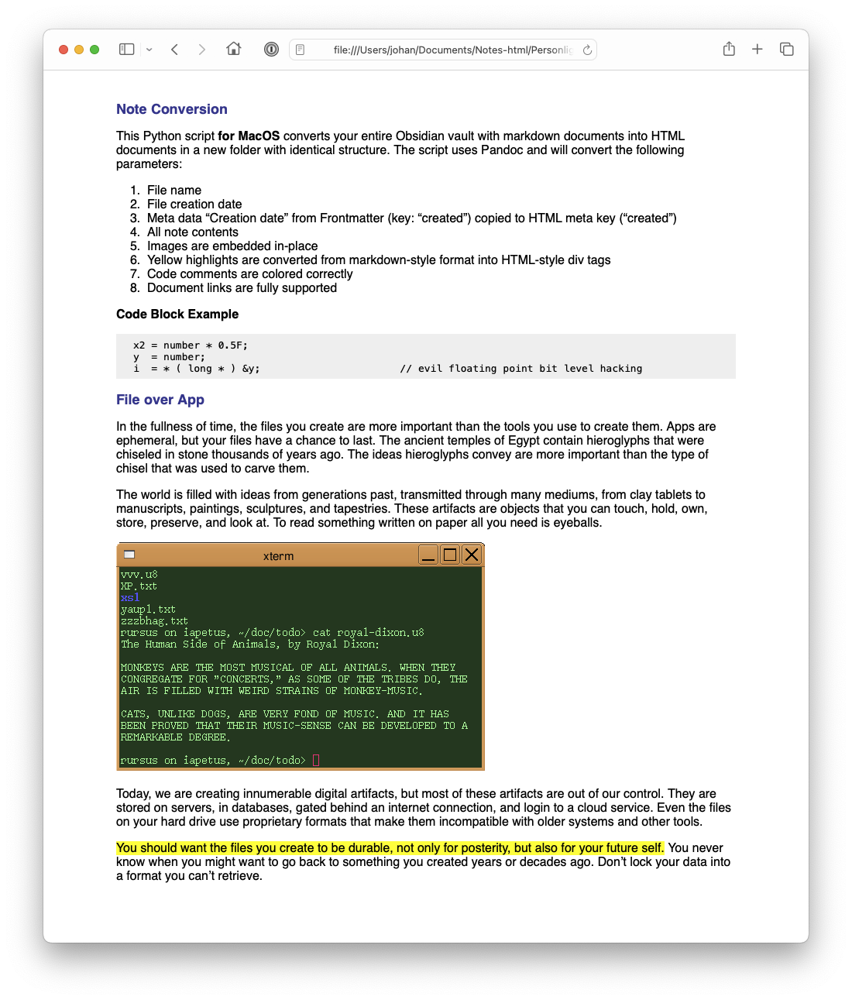

# Obsidian To HTML
This Python script **for Windows and MacOS** converts your entire Obsidian vault with markdown documents into HTML documents in a new folder with identical structure. The script uses Pandoc and will convert the following parameters:

1. File name
2. File creation date
3. Frontmatter properties copied to HTML meta keys. You define the properties you want to be copied over in the file **template.html**
4. All note contents, of course
5. Images are embedded in-place so all notes become self-contained
6. Yellow highlights are converted from markdown-style format into HTML-style div tags
7. Code comments are colored correctly
8. Document links are fully supported


## IMPORTANT

1. You can exclude folders you do not want to process using the variable "excluded_dirs". This is already set to {'_excalidraw', '_resources', '_templates', '.obsidian', '.trash'}.
2. You can modify the file **template.html** according to your likings to change the way the HTML file looks.

To run the script you need Python and Pandoc installed. For Python environment [I recommend PyCharm CE](https://www.jetbrains.com/pycharm/download/other.html), Pandoc [can be downloaded here](https://pandoc.org/installing.html).

## Frontmatter Properties

You can add keys to the file **template.html** for the Frontmatter properties you want to be copied over. For example:

```
<meta name="author" content='$author$'>
<meta name="description" content='$description$'>
<meta name="keywords" content='$keywords$'>
```


## EXAMPLES

Here is a simple example showing how elements are converted from Markdown to HTML:



